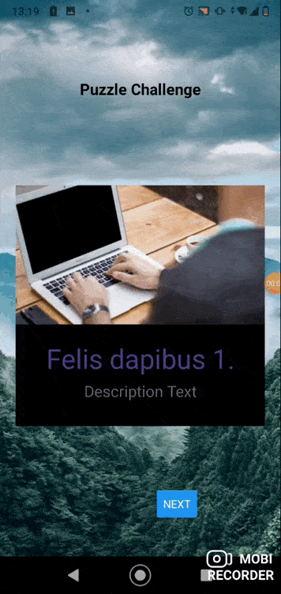

# Puzzle-Challenge
React Native Challenge
Realizado con React Native Expo, hice un carousel para navegar con botones siguiente y anterior
sin utilizar ningun tipo de pluggin

# Pasos para abrir
1- Clonar el repositorio
2- Parados en la carpeta ChallengeCar hacer un npm install
3- Hacer un npm start
4- Abrir la app con cualquier servidor
